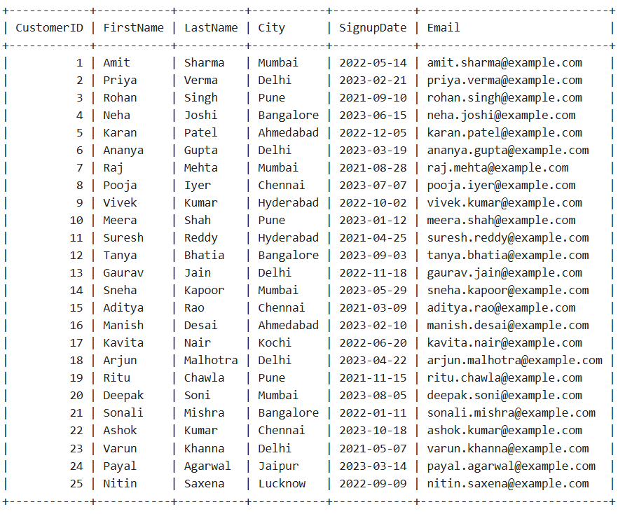
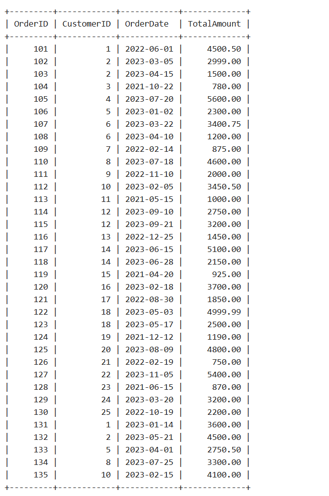
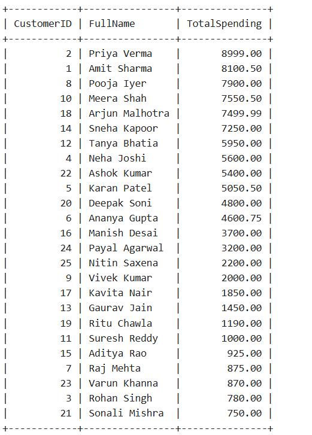

# Artiset-Data Engineer Assignment - 2 (DATA Science Assignment)-Hatim-sidhpurwala-SPSU
Artiset Data Science Interview Task(Assignment) using MySQL

This project was created as part of the Artiset interview process for the Data Science role.

## What is included
- Customers table creation
- Orders table creation
- Data insertion
- Month column added using OrderDate
- Query to calculate total spending for each customer

## Technology Used
- MySQL
- GitHub for submission
## Output Screenshots

### Customers Table

### Orders Table

### Orders Table with Month Column

### Total Spending Result

Note:
I have added the output CSV data files in the `output_data` folder. Kindly check them for verification.

## How to run
1. Copy the SQL code from `artiset_task.sql`
2. Run it in any MySQL environment or online compiler
3. Execute the queries to get results

Prepared by: Hatim Sidhpur wala
ph-+91 7427068253
Gmail-hatim.sidhpurwala@spsu.ac.in
BTech CSE Final Year 
SPSU Udaipur 
